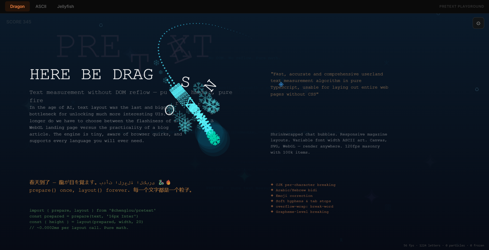
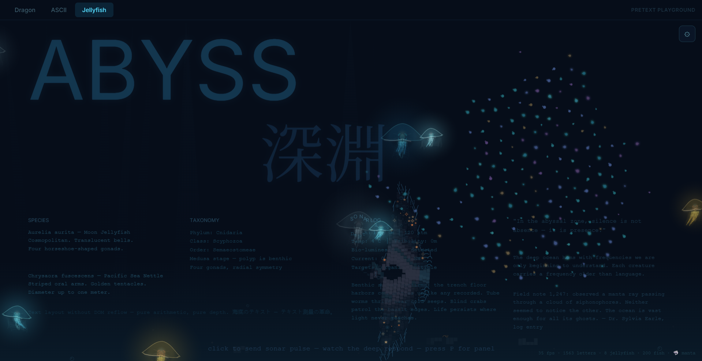
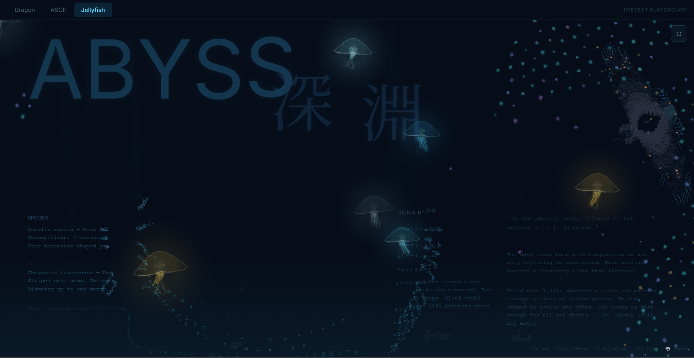
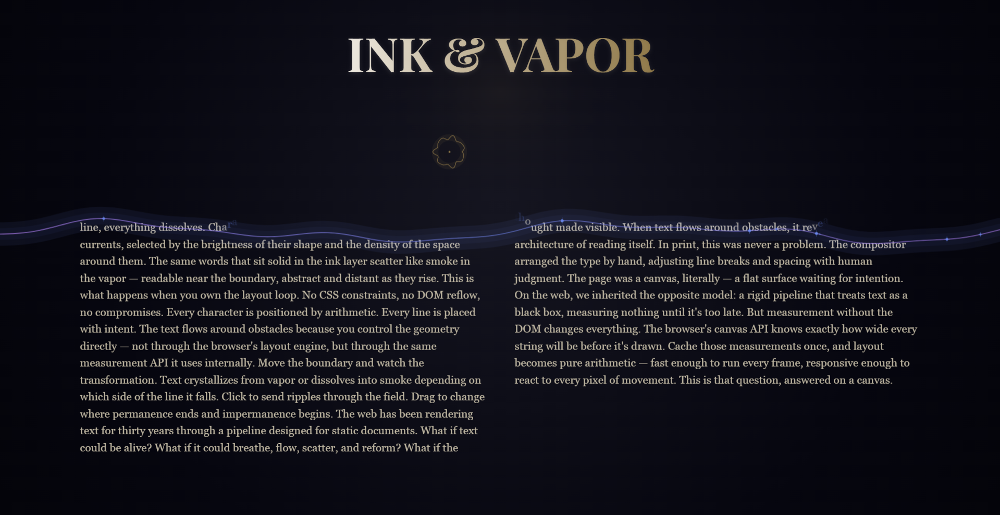
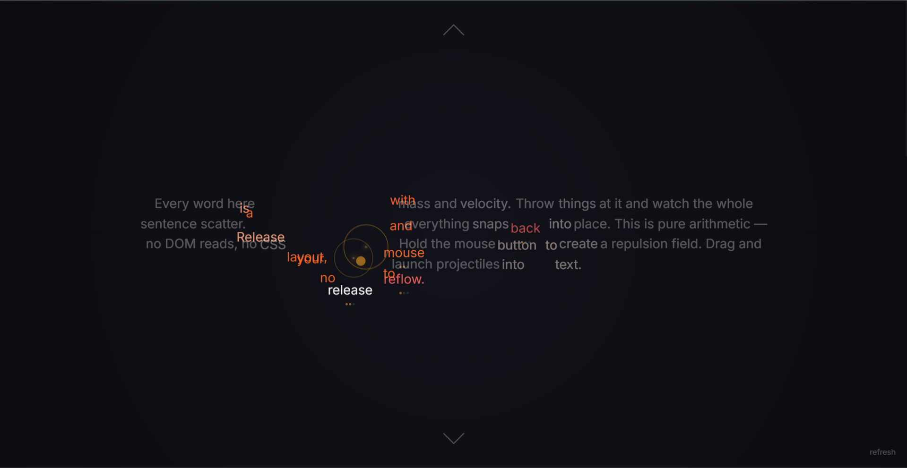
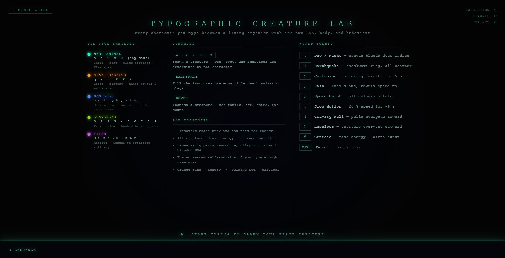
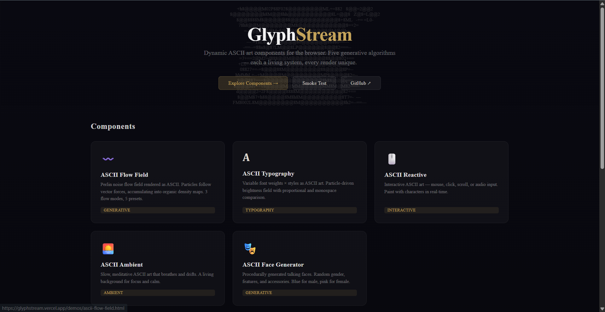
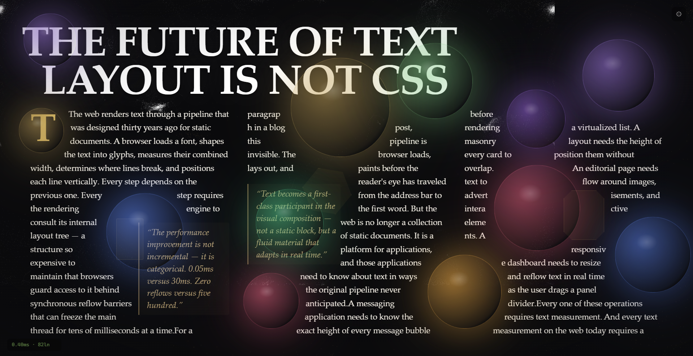

# Pretext Projects — by Poojan Goyani

> **8 text-driven Canvas experiments. Built in 3 days. Zero DOM reads. All MIT.**

| | |
|---|---|
| **Author** | [Poojan Goyani](https://github.com/Poojan38380) |
| **Text Engine** | [@chenglou/pretext](https://github.com/chenglou/pretext) |
| **Stack** | TypeScript · Vite · Canvas 2D |
| **License** | MIT |

---

## What is @chenglou/pretext?

`@chenglou/pretext` is a text measurement and layout library that **bypasses the DOM entirely**. It does a one-time canvas-based measurement via `prepare()`, after which `layout()` is pure arithmetic — roughly **0.0002ms per call**. This unlocks text-heavy UIs at 120fps without ever triggering a reflow.

```ts
import { prepare, layout } from '@chenglou/pretext'

const prepared = prepare(text, '16px Inter')
const { height, lineCount } = layout(prepared, containerWidth, 20)
// No DOM. No reflow. Pure math.
```

Every project below uses pretext as its core text engine.

---

## The Projects

### 1. 🐉 Pretext Playground Upgrade

> *Every character on screen is a physics body.*

[**▶ Live Demo**](https://pretext-playground-upg.vercel.app) · [**Source**](https://github.com/Poojan38380/pretext-playground-upgrade)

Three interactive Canvas 2D demos — each showcasing a fundamentally different application of pretext.

| Demo | Description |
|---|---|
| 🐉 **Dragon** | 60-segment ASCII serpent. Fire/ice breath. Physics letters. 3D multilingual text tunnel. 6 presets. |
| 🪼 **Jellyfish Abyss** | Bioluminescent jellyfish, spring-chain tentacles, sonar pulses, lanternfish flocking AI, manta ray hunter |
| **ASCII** | Matrix Rain, Wave Text, Morph Text, Particle Text, Typewriter |





Performance: Structure-of-Arrays (`Float32Array`), pre-allocated pools, zero GC in game loop.

---

### 2. 🖋️ Ink & Vapor — Generative Typography

> *The boundary between permanence and impermanence is a line you draw.*

[**▶ Live Demo**](https://ink-and-vapor.vercel.app) · [**Source**](https://github.com/Poojan38380/Ink-and-Vapor)

A draggable wavy boundary splits the screen. Below: solid ink typeset in heavy serif. Above: the same text dissolved into a generative particle cloud drifting on noise fields.



| Highlights | |
|---|---|
| Boundary | Animated, draggable wave with click ripples |
| Vapor | fBm noise fields, vortex mode, hover attraction |
| Themes | 3 palettes — Midnight Galaxy, Golden Hour, Ocean Depths |
| Controls | Tunable turbulence, drift speed, density sliders |

---

### 3. 🪲 Exoskeleton — Digital Monograph

> *A Digital Monograph on Insect Morphology.*

[**▶ Live Demo**](https://exoskeleton-tau.vercel.app) · [**Source**](https://github.com/Poojan38380/EXOSKELETON-A-Digital-Monograph)

An interactive, beautifully typeset digital book about entomology. Custom text layout engine (~3,000+ lines) that wraps text around images with bidirectional text support. 75+ tests, CI/CD pipeline.


| Highlights | |
|---|---|
| Compound Eye Cursor | Hexagonal facet grid with chromatic aberration + barrel distortion |
| Pheromone Sim | Click to drop trails; moths navigate toward them |
| Layout Engine | Canvas-based measurement, polygon obstacle avoidance, bidi text |
| Quality | 43 commits, 75+ Vitest tests, GitHub Actions CI |

---

### 4. 🌫️ Aether — Fluid Typography

> *Smoke-like fluid dynamics drive real text layout on Canvas 2D.*

[**▶ Live Demo**](https://aether-sage-beta.vercel.app) · [**Source**](https://github.com/Poojan38380/aether)

Move your mouse to inject ASCII smoke. Body text dynamically flows around high-density regions in real time. Click to send shockwaves.


| Highlights | |
|---|---|
| Fluid sim | Multi-frequency velocity field + semi-Lagrangian advection |
| ASCII smoke | ~200-char brightness-sorted palette, mapped per cell |
| Text layout | Obstacle-aware — carves slots around smoke density |
| Render | Pure Canvas 2D, zero WebGL |

---

### 5. 📖 TextVerse — Scroll-Driven Physics Narrative

> *Text that lives, not just sits.*

[**▶ Live Demo**](https://text-verse.vercel.app) · [**Source**](https://github.com/Poojan38380/TextVerse)

An immersive, scroll-driven Canvas experience where text is the protagonist. Particles assemble into words. Words become physics bodies you can launch projectiles at.



| Highlights | |
|---|---|
| Scenes | Awakening → Collision → Flow (WIP) → Finale (WIP) |
| Physics | Custom spring engine, up to 2000 bodies at 60fps |
| Visuals | Velocity-based color shifting, motion trails, film grain |
| Input | Mouse, scroll, touch |

---

### 6. 🦠 Creature Lab — Typographic Ecosystem

> *Every keystroke spawns a life form.*

[**▶ Live Demo**](https://creature-lab.vercel.app) · [**Source**](https://github.com/Poojan38380/creature-lab)

Type any character and watch procedurally generated organisms emerge. Predators hunt prey. Punctuation triggers earthquakes, rain, slow-motion, and gravity wells.



| Family | Role |
|---|---|
| `a e i o u` | Herd Animal — small, fast, social (prey) |
| `q x z Q X Z` | Apex Predator — large, fastest |
| Consonants | Wanderer — medium, territorial |
| `0–9` | Scavenger — tiny, slow |
| `B C D...` | Titan — massive, immune to predation |

**Punctuation events:** `.` day/night · `!` earthquake · `?` confusion · `,` rain · `;` spore cloud · `:` slow-mo · `()` gravity well/repulsor

---

### 7. ✨ GlyphStream — Generative ASCII Art Engine

> *Five generative algorithms — each a living system, every render unique.*

[**▶ Live Demo**](https://glyphstream.vercel.app) · [**Source**](https://github.com/Poojan38380/glyphstream)

A reusable ASCII art library with five distinct components. Import one, pass config, get living art.



| Component | Description |
|---|---|
| 〰️ **Flow Field** | Perlin noise → particle density → ASCII art |
| **Typography** | Particle-driven brightness with variable font weights |
| 🖱️ **Reactive** | Mouse, click, scroll, or audio-responsive ASCII |
| 🌅 **Ambient** | Slow, meditative — 20–80 particles, gentle forces |
| 🎭 **Face Generator** | Procedural talking faces with random features |

---

### 8. 📰 Typogenesis — Living Editorial Layout

> *Where text breathes, flows, and becomes.*

[**▶ Live Demo**](https://typogenesis.vercel.app) · [**Source**](https://github.com/Poojan38380/Editorial-Engine-Upg)

Multi-column editorial layout where text flows around animated orb obstacles in real time. Layout computation runs in **under 0.5ms** regardless of complexity.



| Highlights | |
|---|---|
| Layout | Multi-column, adaptive headline sizing, shrinkwrap pull quotes |
| Interaction | Drag/click/double-click orbs; keyboard navigation |
| Visual | 1,200-particle flow field, dual themes, film grain |
| Perf | Zero DOM reads, zero reflows, GPU-composited transforms |

---

## Quick Stats

| | |
|---|---|
| Projects | 8 |
| Days to build | 3 |
| Total commits | ~142 |
| Lines of code | ~10,000+ |
| DOM reads per frame | **0** |
| Rendering engines used | Canvas 2D (7), p5.js (1), React + Canvas (1) |
| External UI dependencies | Zero |

---

## How Pretext Powers Each Project

| Project | Pretext Usage |
|---|---|
| **Playground Upgrade** | `prepare()` once; `layout()` per frame for every physics letter |
| **Ink & Vapor** | Lays out editorial typography on Canvas |
| **Exoskeleton** | Frozen `src/pretext/` subdirectory with custom extensions |
| **Aether** | Measures characters for palette; layouts text around smoke density |
| **TextVerse** | Measures text for particle targets and physics body sizing |
| **Creature Lab** | Character measurement in the creature rendering pipeline |
| **GlyphStream** | Core of the brightness field character palette system |
| **Typogenesis** | Full editorial layout — columns, headlines, pull quotes, mixed fonts |

---

## Run Any Project Locally

Each project is standalone. Pick one, clone it, and:

```bash
npm install
npm run dev
```

All projects use **Vite** + **TypeScript** and start a dev server instantly.

---

## Credits

- **Built by** — [Poojan Goyani](https://github.com/Poojan38380) · [LinkedIn](https://www.linkedin.com/in/poojan-goyani-404224253/) · [@Poojan38380](https://twitter.com/Poojan38380)
- **Text engine** — [@chenglou/pretext](https://github.com/chenglou/pretext) by [Cheng Lou](https://github.com/chenglou)
- **All projects** — Open source under [MIT License](https://opensource.org/licenses/MIT)

---

*Built in April 2026. All projects deployed on Vercel.*
